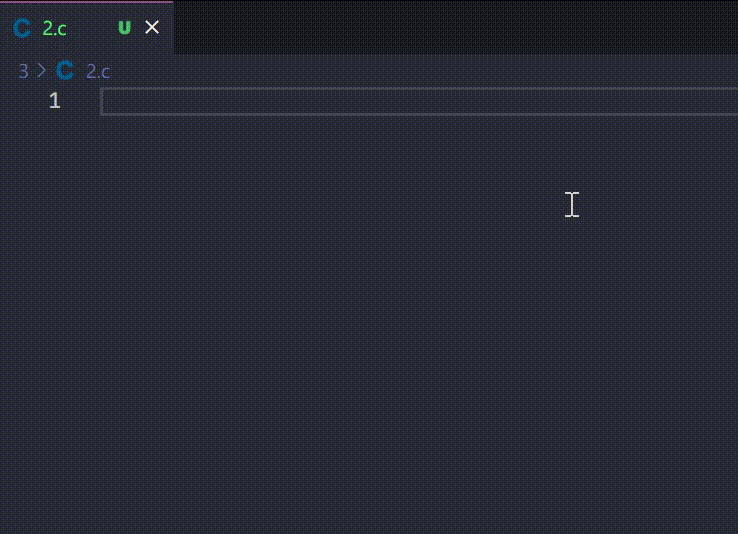

## Introduction

**VSCode(Visual Studio Code)** is a code editor redefined and optimized for building and debugging modern web and cloud applications.

**Code Snippets** is a piece of code, the editor will auto complete a specific code when developer type some specific prefixes.

## Custom Code Snippets

VSCode has many built-in code snippets, so I won't go into details here, but mainly talk about how to customize code snippets.

There are two types of code snippets, one is global and the other is workspace, the difference between them is that the scope and storage location.

- **global code snippets**

  Any file opened by vscode can take effect and is stored in the installation directory.

- **workspace code snippets**

  Only the files in the workspace can take effect and are stored in the .vscode directory of the workspace.

### How to create custom code snippets?

1. Click `File` > `Preferences` > `Configure User Snippets`.
2. Click `New Global Snippets file...` or `New Snippets file for '<your_workspce_name>'...`.
3. Code snippets store as json, Each snippet is defined under a snippet name and has a scope, prefix, body and description:

   - scope: A comma separated ids of the languages where the snippet is applicable. If scope is left empty or omitted, the snippet gets applied to all languages
   - prefix: It's used to trigger the snippet and the body will be expanded and inserted. Possible variables are: `$1`, `$2` for tab stops, `$0` for the final cursor position, and `${1:label}`, `${2:another}` for placeholders
   - body: The code
   - description: The description of this code snippet

   Example:

   ```json
   {
     "scope": "c",
     "prefix": "smain",
     "body": [
       "#include <stdio.h>",
       "",
       "int main(void)",
       "{",
       "\t${1:/* Code here */}",
       "\treturn 0;",
       "}"
     ]
   }
   ```

   A code snippets can store many code snippets, the root is a Object, a property corresponds to a code snippet

   Example:

   ```json
   {
     "Simple main": {
       "scope": "c",
       "prefix": "smain",
       "body": [
         "#include <stdio.h>",
         "",
         "int main(void)",
         "{",
         "\t${1:/* Code here */}",
         "\treturn 0;",
         "}"
       ]
     },
     "Simple main c++": {
       "scope": "cpp",
       "prefix": "smainpp",
       "body": [
         "#include <iostream>",
         "",
         "using namespace std;",
         "",
         "int main()",
         "{",
         "\t${1:/* Code here */}",
         "\treturn 0;",
         "}"
       ]
     }
   }
   ```

4. Use code snippets

   

## Remarks

Reasonable use of code snippets can greatly improve our coding efficiency
