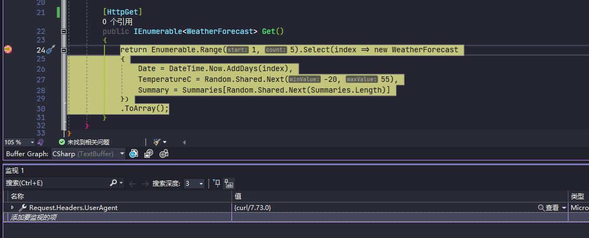
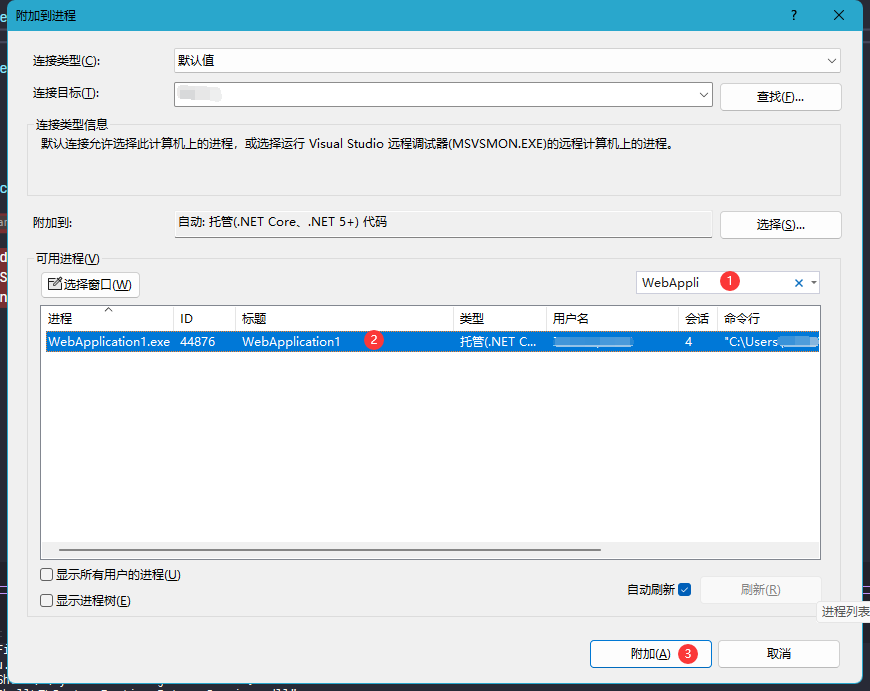

dapr 应用程序是一个多进程程序，对于 Visual Studio 来说可能比较困难

这里介绍两种方法来使用 Visual Studio 调试 dapr 应用程序

1. [使用 VS 扩展](#使用-vs-扩展)
2. [附加进程调试](#附加进程调试)

## 使用 VS 扩展

> 参考 <https://github.com/dapr/dotnet-sdk/issues/401#issuecomment-747563695>

### 准备条件

- 安装 [PowerShell 7 / Core](https://docs.microsoft.com/en-us/powershell/scripting/install/installing-powershell-core-on-windows)
  > 也可使用 `dotnet tool install --global PowerShell` 进行安装
- 安装 VS 扩展 [Microsoft Child Process Debugging Power Tool 2022](https://marketplace.visualstudio.com/items?itemName=vsdbgplat.MicrosoftChildProcessDebuggingPowerTool2022)

### 调试准备

1. 编辑`launchSettings.json`

   ```json {hl_lines=["14-23"]}
   {
     "$schema": "https://json.schemastore.org/launchsettings.json",
     "profiles": {
       "WebApplication1": {
         "commandName": "Project",
         "dotnetRunMessages": true,
         "launchBrowser": true,
         "launchUrl": "weatherforecast",
         "applicationUrl": "http://localhost:5217",
         "environmentVariables": {
           "ASPNETCORE_ENVIRONMENT": "Development"
         }
       },
       "Dapr-PWSH": {
         "commandName": "Executable",
         "executablePath": "pwsh",
         "commandLineArgs": "-Command \"dapr run -a myapp -p 5217 -- dotnet run --no-build\"",
         "workingDirectory": ".",
         "environmentVariables": {
           "ASPNETCORE_ENVIRONMENT": "Development"
         },
         "nativeDebugging": true
       }
     }
   }
   ```

2. 配置调试插件

   打开 `调试` -> `其他调试目标` -> `Child Process Debugging Settings...`

   

   启用`Enable child process debugging` 并设置表格内容如下

   | Enabled | Process name              | Action          | Debugger Type                   |
   | ------- | ------------------------- | --------------- | ------------------------------- |
   | ✅      | `<All other processeses>` | Do not debug    | `<Inherit from parent process>` |
   | ✅      | dapr.exe                  | Attach debugger | Native                          |
   | ✅      | dotnet.exe                | Attach debugger | Native                          |
   | ✅      | `<your_program>.exe`      | Attach debugger | Managed (.NET Core, .NET 5+)    |

   [](child-process-debugging-settings-configure.png)

3. 开始调试

   打上断点，启动配置选择 `Dapr-PWSH`，按下 <kbd>F5</kbd> 即可使用 dapr 启动程序并进行调试
   

   - 使用 curl 调用 API 看能否进入断点

     ```shell
     curl http://localhost:5217/weatherforcast
     ```

     

     > 通过 `Requeset.Headers.UserAgent` 可以看出此请求来源是 curl

   - 使用 dapr CLI 调用看能否进入断点

     ```shell
     dapr invoke -a myapp -m weatherforcast -v GET
     ```

     

     > dapr 使用 go 语言编写，所以 `Requeset.Headers.UserAgent` 显示 `Go-http-client/1.1`

此方法调试的优点是简单，需要调试时候按下 <kbd>F5</kbd> 即可调试，和普通程序调试没有区别，但是我本人在使用过程中发现此方法调试过程**有点卡顿**，具体原因不知

## 附加进程调试

此方法则是使用 VS 自带的附加调试功能，无需安装多余的软件和扩展

1.  使用 dapr 启动程序

    ```shell
    dapr run -a myapp -p 5217 -- dotnet run
    ```

2.  通过菜单或使用快捷键 <kbd>Ctrl</kbd>+<kbd>Alt</kbd>+<kbd>P</kbd> 打开附加调试

    

    选择程序对应的进程，可以使用搜索窗口进行过滤

    

    此时 Visual Studio 就会进入调试状态，通过 curl 或 dapr 调用 api 都能进入断点

    > 如果 VS 已经附加过进程，可以通过 <kbd>Shift</kbd>+<kbd>Alt</kbd>+<kbd>P</kbd> 快速附加到上一次选择的同名进程

此方法和[使用 VS 扩展](#使用-vs-扩展)相比，启动和调试分成了两个操作，在面对频繁的启动调试时可能比较繁琐，但是我本人用此方法调试不会感觉到卡顿

> 附加调试不仅能调试 dapr 应用程序，还支持许多[更复杂的调试操作](https://learn.microsoft.com/zh-cn/visualstudio/debugger/attach-to-running-processes-with-the-visual-studio-debugger?view=vs-2022)
