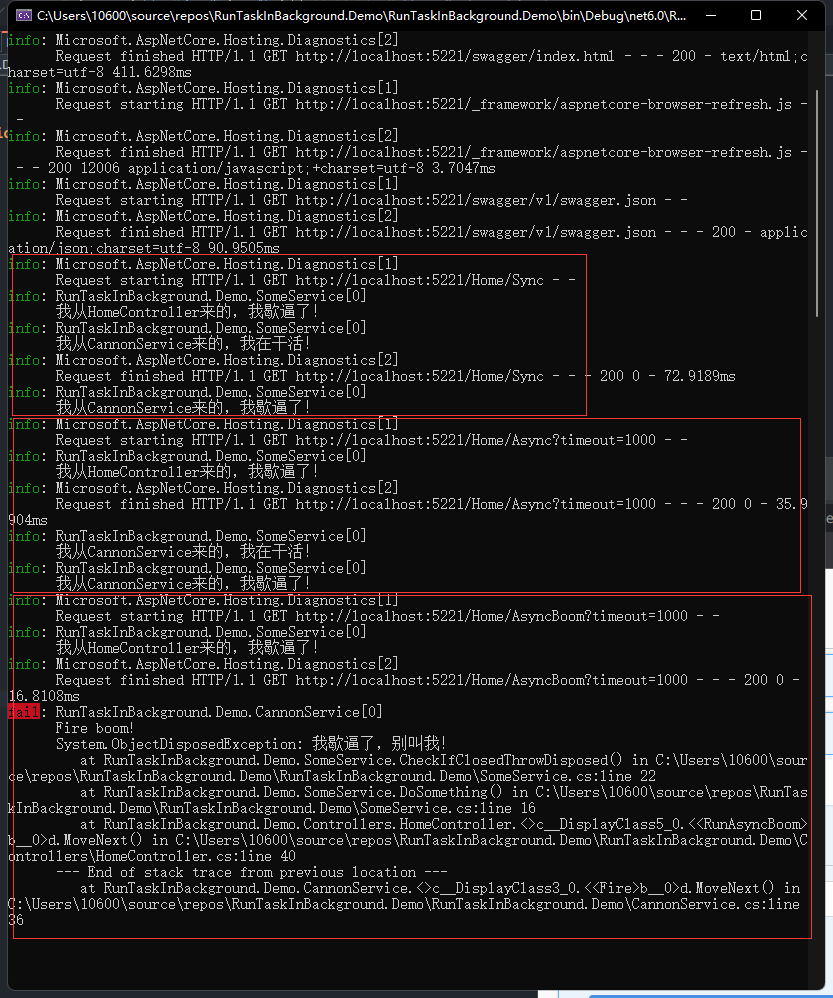

## 引言

有时候我们可能想在接口中开启一个后台任务，就像这样:

```csharp
public class MyController : Controller
{
    private readonly MyDependency _dep;

    public MyController(MyDependency d)
    {
        _dep = d;
    }

    public IActionResult MyAction()
    {
        Task.Run(() => _dep.DoHeavyAsyncWork());
        return Json("Your job is started!");
    }
}
```

事实上，这段代码很符合语义，接口也能成功返回。
但是其中有一个潜在问题，随着`return`语句响应本次请求，`ASP.NET Core`会开始释放本次请求的依赖，比如控制器和控制器依赖的各种服务……，这就会导致`Task.Run`语句中的所依赖的定义在控制器中的服务会被释放掉，这可能会导致一些未知的问题。这些潜在问题可能会让你的应用程序**随时爆炸**！

## 让后台任务拥有自己的生存期

为了保证后台服务的依赖不随控制器释放而释放，我们需要定义一个新的服务并将其注册为单例服务，因为单例服务永远不会被释放。

1. 创建一个名为`CannonService`的类

   **CannonService.cs**

   ```csharp
   public class CannonService
   {
       private readonly ILogger<CannonService> _logger;
       private readonly IServiceProvider _serviceProvider;
       public CannonService(ILogger<CannonService> logger, IServiceProvider serviceProvider)
       {
           _logger = logger;
           _serviceProvider = serviceProvider;
       }

       public void Fire(Delegate dg, Action<Exception>? exceptionHandler = null)
       {
           if (dg == null)
           {
               return;
           }
           Task.Run(async () =>
           {
               // 通过反射获取委托的参数列表
               var parameterTypes = dg.Method.GetParameters().Select(x => x.ParameterType).ToArray();
               var parameters = ArrayPool<object>.Shared.Rent(parameterTypes.Length);
               try
               {
                   // 创建一个scope
                   using var scope = _serviceProvider.CreateScope();
                   // 获取委托的参数实例
                   for (var i = 0; i < parameterTypes.Length; i++)
                   {
                       var t = parameterTypes[i];
                       parameters[i] = scope.ServiceProvider.GetRequiredService(t);
                   }
                   // 判断委托是是异步还是同步
                   var returnType = dg.Method.ReturnType;
                   if (returnType.IsAssignableTo(typeof(Task)))
                   {
                       await (Task)dg.DynamicInvoke(parameters.Take(parameterTypes.Length).ToArray())!;
                   }
                   else
                   {
                       dg.DynamicInvoke(parameters.Take(parameterTypes.Length).ToArray());
                   }
               }
               catch (Exception e)
               {
                   _logger.LogError(e, "Fire boom!");
                   exceptionHandler?.Invoke(e);
               }
               finally
               {
                   ArrayPool<object>.Shared.Return(parameters, true);
               }
           });
       }
   }
   ```

2. 将`CannonService`注册为单例服务
   **Program.cs**

   ```csharp
   builder.Services.AddSingleton<CannonService>();
   ```

3. 在需要的地方注入该服务并使用

   - 触发同步方法

     ```csharp
     _cannonService.Fire((SomeService someService) =>
     {
         someService.From = nameof(CannonService);
         someService.DoSomething();
     });
     ```

   - 触发异步方法

     ```csharp
     _cannonService.Fire(async (SomeService someService) =>
     {
         someService.From = nameof(CannonService);
         await Task.Delay(timeout);
         someService.DoSomething();
     });
     ```

## 示例

**SomeService.cs**

```csharp
namespace RunTaskInBackground.Demo
{
    public class SomeService : IDisposable
    {
        private readonly ILogger<SomeService> _logger;
        private bool disposedValue;

        public string From { get; set; } = null!;
        public SomeService(ILogger<SomeService> logger)
        {
            _logger = logger;
        }

        public void DoSomething()
        {
            CheckIfClosedThrowDisposed();
            _logger.LogInformation("我从{From}来的，我在干活！", From);
        }
        void CheckIfClosedThrowDisposed()
        {
            if (disposedValue)
                throw new ObjectDisposedException(null, "我歇逼了，别叫我！");
        }
        protected virtual void Dispose(bool disposing)
        {
            if (!disposedValue)
            {
                if (disposing)
                {
                    if (!string.IsNullOrEmpty(From))
                    {
                        _logger.LogInformation("我从{From}来的，我歇逼了！", From);
                    }
                    else
                    {
                        _logger.LogInformation("我没有🐎，我歇逼了！");
                    }
                }
                disposedValue = true;
            }
        }

        public void Dispose()
        {
            Dispose(disposing: true);
            GC.SuppressFinalize(this);
        }
    }
}
```

**Program.cs**

```c#
using RunTaskInBackground.Demo;

var builder = WebApplication.CreateBuilder(args);

// Add services to the container.

builder.Services.AddControllers();
// Learn more about configuring Swagger/OpenAPI at https://aka.ms/aspnetcore/swashbuckle
builder.Services.AddEndpointsApiExplorer();
builder.Services.AddSwaggerGen();
builder.Services.AddSingleton<CannonService>();
builder.Services.AddScoped<SomeService>();

var app = builder.Build();

// Configure the HTTP request pipeline.
if (app.Environment.IsDevelopment())
{
    app.UseSwagger();
    app.UseSwaggerUI();
}

app.UseAuthorization();

app.MapControllers();

app.Run();
```

**HomeController.cs**

```csharp
using Microsoft.AspNetCore.Mvc;

namespace RunTaskInBackground.Demo.Controllers
{
    [ApiController]
    [Route("[controller]")]
    public class HomeController : ControllerBase
    {
        private readonly ILogger<HomeController> _logger;
        private readonly CannonService _cannonService;
        private readonly SomeService _someService;
        public HomeController(ILogger<HomeController> logger, CannonService cannonService, SomeService someService)
        {
            _logger = logger;
            _cannonService = cannonService;
            _someService = someService;
            _someService.From = nameof(HomeController);
        }

        [HttpGet]
        [Route("Async")]
        public IActionResult RunAsync(int timeout = 1000)
        {
            _cannonService.Fire(async (SomeService someService) =>
            {
                someService.From = nameof(CannonService);
                await Task.Delay(timeout);
                someService.DoSomething();
            });
            return Ok();
        }

        [HttpGet]
        [Route("AsyncBoom")]
        public IActionResult RunAsyncBoom(int timeout = 1000)
        {
            _cannonService.Fire(async () =>
            {
                await Task.Delay(timeout);
                _someService.DoSomething();
            });
            return Ok();
        }

        [HttpGet]
        [Route("Sync")]
        public IActionResult RunSync()
        {
            _cannonService.Fire((SomeService someService) =>
            {
                someService.From = nameof(CannonService);
                someService.DoSomething();
            });
            return Ok();
        }
    }
}
```

在 swagger 中分别调用 `Sync`，`Async`，`AsyncBoom` 接口，结果如下图所示：



附[完整 Demo 地址](https://github.com/fissssssh/RunTaskInBackground.Demo)

## 参考

1. Anduin Xue.Fire and forget in ASP.NET Core with dependency alive[EB/OL].(2020-10-14)[2022-06-27].<https://anduin.aiursoft.com/post/2020/10/14/fire-and-forget-in-aspnet-core-with-dependency-alive>

> 本作品采用[署名-相同方式共享 4.0 国际](https://creativecommons.org/licenses/by-sa/4.0/deed.zh)协议许可
