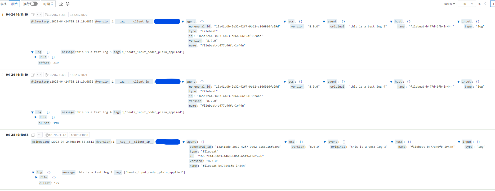

当你的应用程序越来越大，日志的管理变得越来越困难。而将日志存储在云服务上是现代化应用中的一个不可忽视的方面。在云服务中，阿里云 SLS 是一个非常好的选择，它可以帮助你收集、存储和查询应用程序日志。但是，如何将应用程序的日志发送到阿里云 SLS 服务呢？今天，我们将使用 Logstash，一个流行的开源工具，来将我们的日志发送到阿里云 SLS 服务中。

# 简介

## 阿里云 SLS 服务

阿里云 SLS（云监控日志服务）是一种高可靠、高扩展性的日志服务，主要用于收集和实时处理来自服务器、应用程序和云产品的日志数据。 SLS 提供了实时的查询、统计和报警等功能，有助于用户更轻松地管理日志。

SLS 支持大规模的日志数据处理，可以通过多种方式上传日志数据，例如 SDK、API、SLS Agent、Logstash 等，使用 SLS 可以快速查询、分析和可视化日志数据，帮助用户更好地理解自己的应用环境。

## Logstash

Logstash 则是一款通用的日志收集工具，可以将来自不同来源的日志数据进行收集、处理、转换和传输。Logstash 可以与各种插件配合使用，从而实现更多功能。例如，用户可以使用 Logstash 的 input 插件来收集来自多个来源的日志数据，使用 filter 插件来解析、过滤和重构这些数据，最后使用 output 插件将处理后的数据发送到各种目的地，如 Elasticsearch、Kibana 等。

# 准备工作

## 创建阿里云 SLS 服务实例

略

## 安装 Logstash

> 本文使用的 Logstash 版本为 `8.7.0`（截至本文发布最新版）

阿里云[官方文档](https://help.aliyun.com/document_detail/49019.html?spm=a2c4g.28984.0.0.323e3e4awhfoI9)介绍了如何安装 Logstash，但如果要在 K8s 中运行则需要进行一些其他操作：

1. 构建带有 `logstash-output-logservice` 插件的 Logstash 镜像
2. 编写 `Logstash` 配置文件
3. 部署至 K8s

### 构建镜像

通过 Dockerfile 来构建包含 `logstash-output-logservice` 插件的 Logstash 镜像，文件内容如下：

```Dockerfile
FROM docker.elastic.co/logstash/logstash:8.7.0

RUN ./bin/logstash-plugin install logstash-output-logservice
```

在 Dockerfile 所在目录执行构建命令

```bash
$ docker build -t logstash-output-logservice:v1.0.0 .
```

### 配置文件

- logstash.yml

  ```yml
  http.host: "0.0.0.0"
  ```

  > 默认的 `logstash.yml` 中包含 elasticsearch 的终结点配置，不删掉该配置会在 Logstash 的日志中输出一些 `WARNING`

- logstash.conf

  ```ruby
  input {
      beats {
        port => "5044"
      }
  }

  output {
      logservice {
        codec => "json"
        endpoint => "***"
        project => "***"
        logstore => "***"
        topic => ""
        source => ""
        access_key_id => "***"
        access_key_secret => "***"
        to_json => true
        max_send_retry => 10
        max_buffer_items => 4000
        max_buffer_bytes => 2097152
        max_buffer_seconds => 3
      }
  }
  ```

  > `logstash.conf` 为管道配置文件，包含`input`，`filter` 和 `output` 三部分，分别定义了输入，过滤器和输出，这里是简单介绍就不写过滤器
  >
  > `access_key` 必须具有 `log:PostLogStoreLogs` 权限才能写入日志

### 部署

为了将 Logstash 部署至 K8s 中，我们还需要编写对应的资源文件：

- logstash.yml

  ```yml
  apiVersion: v1
  kind: ConfigMap
  metadata:
    name: logstash
  data:
    logstash.yml: |-
      http.host: "0.0.0.0"
    logstash.conf: |-
      input {
        beats {
          port => "5044"
        }
      }

      output {
        logservice {
          codec => "json"
          endpoint => "***"
          project => "***"
          logstore => "***"
          topic => ""
          source => ""
          access_key_id => "***"
          access_key_secret => "***"
          to_json => true
          max_send_retry => 10
          max_buffer_items => 4000
          max_buffer_bytes => 2097152
          max_buffer_seconds => 3
        }
      }
  ---
  apiVersion: apps/v1
  kind: Deployment
  metadata:
    name: logstash
    labels:
      app: logstash
  spec:
    replicas: 1
    selector:
      matchLabels:
        app: logstash
    template:
      metadata:
        labels:
          app: logstash
      spec:
        containers:
          - name: logstash
            image: logstash-output-logservice:v1.0.0
            imagePullPolicy: IfNotPresent
            ports:
              - containerPort: 5044
                name: beats
              - containerPort: 9600
                name: http
            volumeMounts:
              - name: config
                mountPath: /usr/share/logstash/pipeline/logstash.conf
                subPath: logstash.conf
              - name: config
                mountPath: /usr/share/logstash/config/logstash.yml
                subPath: logstash.yml
            resources:
              limits:
                cpu: 1000m
                memory: 2Gi
              requests:
                cpu: 500m
                memory: 1Gi
        volumes:
          - name: config
            configMap:
              name: logstash
  ---
  apiVersion: v1
  kind: Service
  metadata:
    name: logstash
    labels:
      app: logstash
  spec:
    selector:
      app: logstash
    ports:
      - name: beats
        port: 5044
        targetPort: beats
      - name: http
        port: 9600
        targetPort: http
  ```

使用以下指令部署：

```bash
$ kubectl apply -f logstash.yml
```

部署成功后通过 `kubectl get po` 可以看到正常运行的 Logstash

```bash
$ kubectl get po
NAME                         READY   STATUS    RESTARTS   AGE
logstash-67758cfc7b-n4xm5    1/1     Running   0          2m
```

# 测试

上面的配置中 `input` 配置为了 `beats`，所以我们使用 Filebeat 来进行测试

> 本文使用的 Filebeat 版本为 `8.7.0`

## 运行 filebeat

- filebeat.yml
  ```yml
  apiVersion: v1
  kind: ConfigMap
  metadata:
    name: filebeat
  data:
    filebeat.yml: |-
      filebeat.inputs:
      - type: log
        paths:
          - /usr/share/filebeat/logs/test.log 
      output.logstash:
        hosts: ["logstash:5044"]
  ---
  apiVersion: apps/v1
  kind: Deployment
  metadata:
    name: filebeat
    labels:
      app: filebeat
  spec:
    replicas: 1
    selector:
      matchLabels:
        app: filebeat
    template:
      metadata:
        labels:
          app: filebeat
      spec:
        containers:
          - name: filebeat
            image: docker.elastic.co/beats/filebeat:8.7.0
            volumeMounts:
              - name: config
                mountPath: /usr/share/filebeat/filebeat.yml
                subPath: filebeat.yml
        volumes:
          - name: config
            configMap:
              name: filebeat
              items:
                - key: filebeat.yml
                  path: filebeat.yml
  ```
  在 ConfigMap 中我们配置了监听容器内 `/usr/share/filebeat/logs/test.log` 文件的变化，并输出到 `logstash:5044`（此地址对应上一章节部署 Logstash 时的 Service 定义）

使用以下指令部署：

```bash
$ kubectl apply -f filebeat.yml
```

部署成功后通过 `kubectl get po` 可以看到正常运行的 Logstash 和 Filebeat

```bash
$ kubectl get po
NAME                         READY   STATUS    RESTARTS   AGE
filebeat-b477d46fb-lr44n     1/1     Running   0          2m
logstash-67758cfc7b-n4xm5    1/1     Running   0          5m
```

使用以下指令进行测试：

```bash
# 进入 Filebeat 容器
$ kubectl exec -it filebeat-b477d46fb-lr44n -- bash
# 使用 echo 指令模拟写日志到 logs/test.log
filebeat@filebeat-b477d46fb-lr44n:~$ echo "this is a test log 3" >> logs/test.log
filebeat@filebeat-b477d46fb-lr44n:~$ echo "this is a test log 4" >> logs/test.log
filebeat@filebeat-b477d46fb-lr44n:~$ echo "this is a test log 5" >> logs/test.log
```

此时在 Logstash 容器的日志中可以看到以下输出：

```bash
[2023-04-24T08:10:58,826][INFO ][logstash.outputs.logservice][main] send logs to logservice success {:logcount=>"1"}
[2023-04-24T08:11:11,805][INFO ][logstash.outputs.logservice][main] send logs to logservice success {:logcount=>"1"}
[2023-04-24T08:11:12,303][INFO ][logstash.outputs.logservice][main] send logs to logservice success {:logcount=>"1"}
```

表示我们的日志成功写到了阿里云 SLS 中，登录阿里云控制台进行查看：



# 参考资料

- [Parsing Logs with Logstash](https://www.elastic.co/guide/en/logstash/8.7/advanced-pipeline.html)
- [安装 Logstash](https://help.aliyun.com/document_detail/49019.html?spm=a2c4g.28984.0.0.323e3e4awhfoI9)
- [创建 Logstash 采集配置和处理配置](https://help.aliyun.com/document_detail/28984.html?spm=a2c4g.49019.0.0.3106416fVC5SGL)
